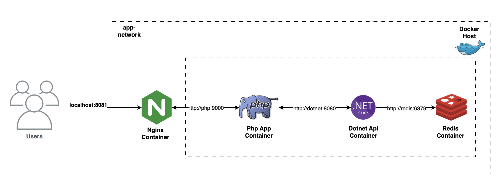

# Test App

## Architecture Diagram



## How to start this service

```
docker-compose up -d
```

## Access the Server

```
Open your browser and go to http://localhost:8081
```

## Test the app

```
Enter a new key and value through the input fields.
Next, you can search for the previously saved key in the app.
```

### Components Summary

- docker-dotnet-sample
  - Dotnet Core 8.0
  - Rest Api
- docker-php-sample
  - Php 8.2
  - Frontend App Example
  - Communicates with docker-dotnet-sample through Rest API
- docker-nginx-conf
  - Exposes the PHP component
  - Access at http://localhost:8081
# docker-compose-samples
